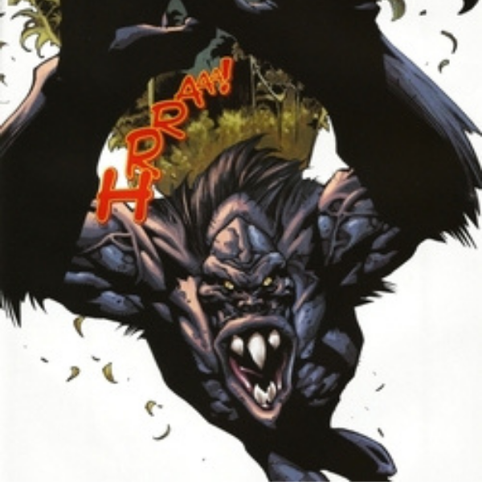
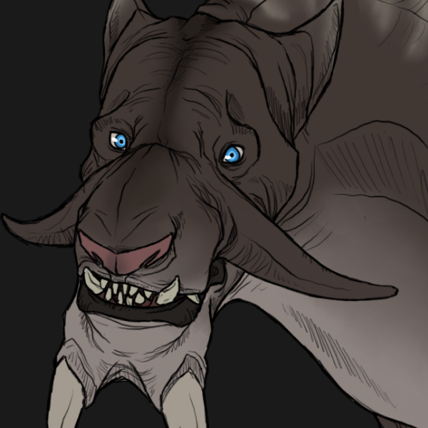
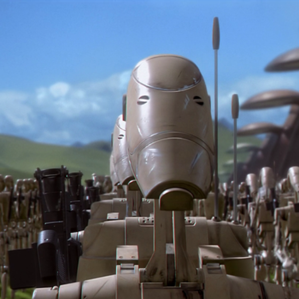
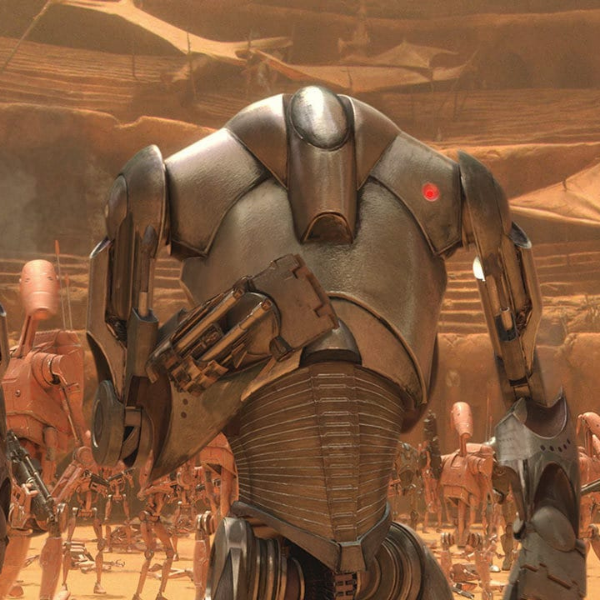
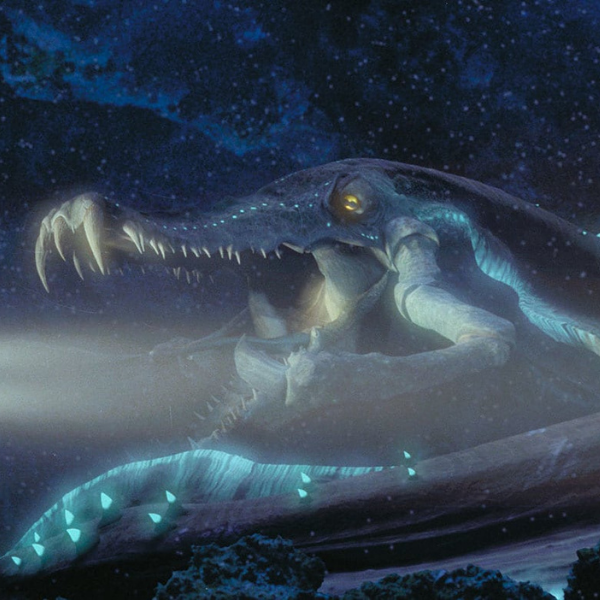
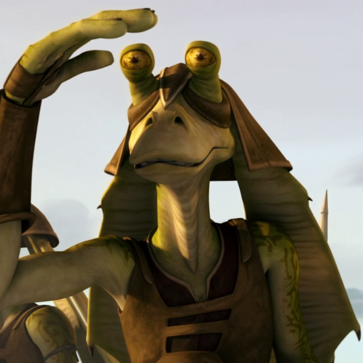
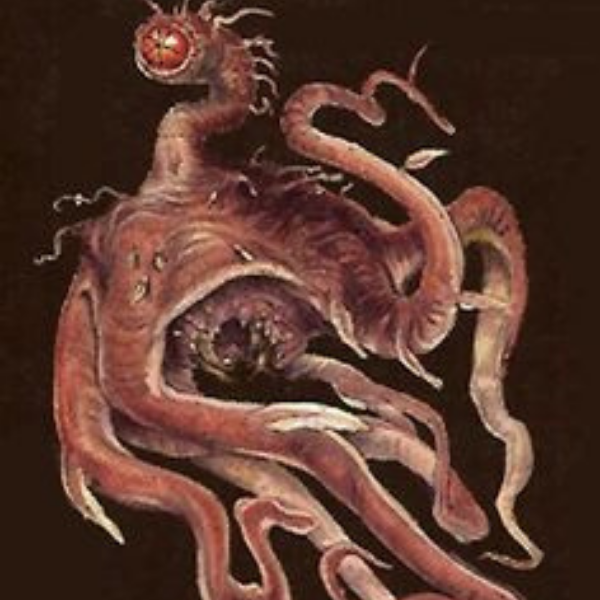

# **Star Wars: The Shattering of the Force**

## **História do Jogo**

### **Sobre o Universo**

Há muito tempo, em uma galáxia muito, uma enquetação ameaça por fim aos tempos de paz, os cavaleiros Jedi, guardiões da paz e da justiça na galáxia, são os unicos capazes de resolver esse conflito. Os Jedi são uma ordem de indivíduos sensíveis à Força(A Força é o que dá poder ao Jedi. É um campo de energia criado por todos os seres vivos, ela nos envolve e penetra. É o que mantém a galáxia unida), que estudava, servia-a, e usava as energias místicas da Força. A ferramenta de um Jedi é o sabre de luz, uma lâmina de energia pura.

O grande Templo Jedi, sede da Ordem Jedi desde a conclusão da Grande Guerra Sith sendo o lar de seu principal treinamento, facilidades burocráticas e dormitórios, estando situado no planeta de Naboo, na Orla Média, Naboo tinha é um planeta de renome em toda a galáxia, reconhecido como um centro de paz e aprendizado. 

 Os Sith, coletivamente chamados de Ordem Sith, eram uma ordem de usuários da Força que se utilizavam do lado sombrio da Força para ganhar poder pela galáxia. Os Sith eram antigos inimigos da Ordem Jedi e lutaram inúmeras guerras contra a Ordem por milhares de anos, apesar de teoricmente instintos, novos indicios preucupam a ordem Jedi. 

### **Episódio I - Parte I - Surgimento dos clones**

#### **Abertura**

Você é jovem padawan(aprendiz de Jedi) inicia sua trajetória treinando para se tornar Jedi e ajudar o seu povo na guerra. Sua trajetória terá muitos desafios que colocarão em dúvida a sua integridade moral. Qual caminho você seguirá?

#### **História**

Uma inquietação toma conta do Senado Galáctico. Milhares de sistemas solares declararam suas intenções em deixar a República. Esse movimento separatista, sob a liderança do misterioso Conde Dookan, tem criado dificuldades para o limitado número de Cavaleiros Jedi manter a paz e a ordem na galáxia. Senadora Amidala, a antiga rainha de Naboo, está retornando ao Senado Galáctico para a votação da proposta crítica de criação de um Exército da República, para auxiliar os sobrecarregados Jedi...

#### **Mapa - Naboo**

Você iniciará sua estrada no planeta Naboo, um grande planeta na orla media que possui belas cidades que coexistiam em harmonia com as planícies gramadas e as colinas que as cercavam. O clima era temperado, e os predadores mais perigosos eram relegados, principalmente, ao peculiar núcleo aquático de Naboo. Ao contrário da maioria dos planetas que possuíam núcleos de lava, Naboo era vazado e preenchido com oceanos que correm em seu centro. 

 Naboo é a terra natal dos humanos, mas além dos humanos ha outra espécie nativa civilizada: os Gungans. Ao contrário dos pacifistas Naboo, os Gungans mantinham um exército permanente, e sabia-se que havia conflitos entre tribos. Na maior parte do tempo, os Chefes Gungan mantinham a paz e havia tempo para se concentrar em coisas mais refinadas, como a contínua evolução da tecnologia das bolhas hidrostáticas que sustentavam suas cidades subaquáticas. Embora os Naboo e Gungans não estejam em conflito ativo, ha uma inegável tensão entre eles, sendo que raramente se misturam. 

 O planeta de Naboo é divido em algumas principais regiões que você poderá explorar: 

- Floresta 
- Planicie Naboo 
- Lianorm swamp 
- Colinas verdejantes 
- Paonga island 
- Lake Paonga

Cada região tem suas caracteristicas especificas para se explorar mas tome bastante cuidado, apesar de Naboo ser um lugar paradisíaco também está cheio de espécies peculiares e predadores ferozes, aqui você poderá encontrar:

 

 

**Ewok**

{width=50px}

| Atributo | Valor |
| ---- | ----- |
| Inteligencia | 3 |
| Força fisica | 2 |
| Agilidade | 3 |
| Resistência | 2 |

 
 

**Veermok**

{width=50px}

| Atributo | Valor |
| ---- | ----- |
| Inteligencia | 3 |
| Força fisica | 4 |
| Agilidade | 5 |
| Resistência | 3 |

 
 

 

**Shaak**

{width=50px}

| Atributo | Valor |
| ---- | ----- |
| Inteligencia | 1 |
| Força fisica | 2 |
| Agilidade | 4 |
| Resistência | 1 |

 

 

**Tusk Cat**

{width=50px}

| Atributo | Valor |
| ---- | ----- |
| Inteligencia | 4 |
| Força fisica | 5 |
| Agilidade | 7 |
| Resistência | 4 |

 
 

 

**Droid de batalha B1**

{width=50px}

| Atributo | Valor |
| ---- | ----- |
| Inteligencia | 2 |
| Força fisica | 3 |
| Agilidade | 3 |
| Resistência | 4 |

 
 

 

**Super Droid**

{width=50px}

| Atributo | Valor |
| ---- | ----- |
| Inteligencia | 5 |
| Força fisica | 5 |
| Agilidade | 4 |
| Resistência | 6 |

 

 

**Colo Claw Fish**

{width=50px}

| Atributo | Valor |
| ---- | ----- |
| Inteligencia | 7 |
| Força fisica | 10 |
| Agilidade | 10 |
| Resistência | 8 |

 

 

**Gungan**

{width=50px}

| Atributo | Valor |
| ---- | ----- |
| Inteligencia | 2 |
| Força fisica | 4 |
| Agilidade | 3 |
| Resistência | 3 |

 

 

**Dianoga**

{width=50px}

| Atributo | Valor |
| ---- | ----- |
| Inteligencia | 9 |
| Força fisica | 10 |
| Agilidade | 10 |
| Resistência | 9 |

 

 

**Wampa**

{width=50px}

| Atributo | Valor |
| ---- | ----- |
| Inteligencia | 7 |
| Força fisica | 5 |
| Agilidade | 6 |
| Resistência | 10 |

Batalhar com monstros pode ser uma otima maneira de treinar suas habilidades e se tornar mais habilidoso e poderoso, mas tome cuidado, um Jedi tem que julgar quais batalhas deve travar, batalhar seres pacificos pode te levar ao lado negro, as vezes o melhor é evitar o conflito.

 