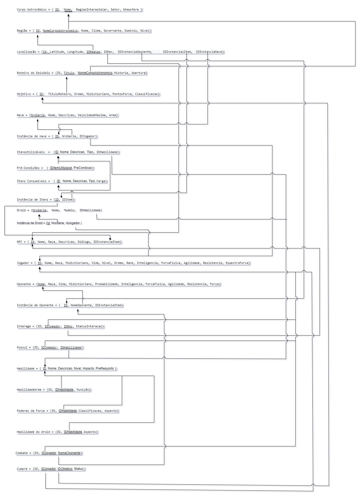

# **1. Normalização**

&emsp;&emsp;&emsp; A normalização é um processo formal e passo a passo que examina os atributos de uma entidade, com o objetivo de evitar anomalias observadas na inclusão, exclusão e alteração de registros.

&emsp;&emsp;&emsp; A teoria de normalização provê:

&emsp;&emsp;&emsp;&emsp;• uma maneira formal de melhoria de projeto;

&emsp;&emsp;&emsp;&emsp;• desenvolve a intuição de projetos de melhor qualidade.

## **1.1. Formas Normais**
&emsp;&emsp;&emsp;As formas normais são sequenciais, ou seja, se um banco se encontra na terceira forma normal, isso também significa que o mesmo está na segunda e também na primeira. Por isso devemos sempre começar a normalização pela primeira forma normal, para que não hajam problemas mais a frente na nossa normalização.

## **1.2. Versão 1**

&emsp;&emsp;&emsp;Normalizações realizadas:

&emsp;&emsp;&emsp;&emsp; • O atributo multivalorado "Pré-condições" foi retirado da relação Itens Utilizáveis;
&emsp;&emsp;&emsp;&emsp; • O modelo relacional abaixo atende à primeira, segunda, terceira, quarta e Boyce-Codd Forma Normal.

<a href="https://sbd1.github.io/Grupo02-starWars/modulo3/img/normal-v1.png" target="_blank">Clique aqui</a> para ver o modelo com mais detalhes.

## **1.3. Outras Versões**

  
Versão 0.1
 

  

  <a href="https://sbd1.github.io/Grupo02-starWars/modulo3/img/normal-v0.1.svg" target="_blank">Clique aqui</a> para ver o modelo com mais detalhes.

